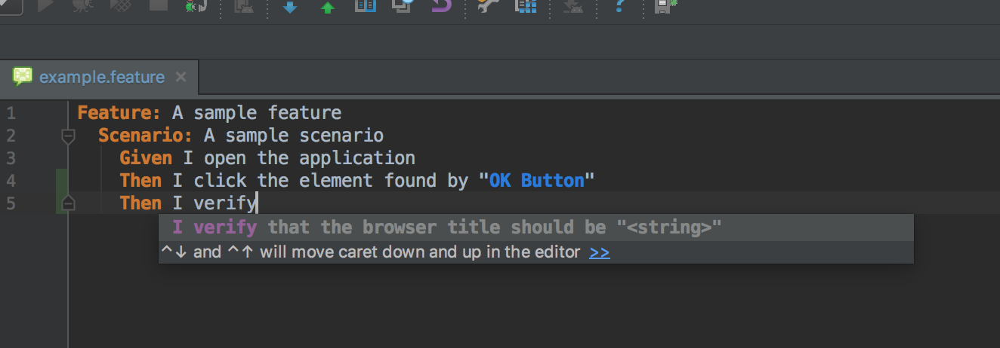

* Install the `Cucumber for Java` plugin in IntelliJ
* Import this Gradle project
* Edit files under the `src/test/resources` directory. You'll have the Iridium step definitions available through the IntelliJ editor

